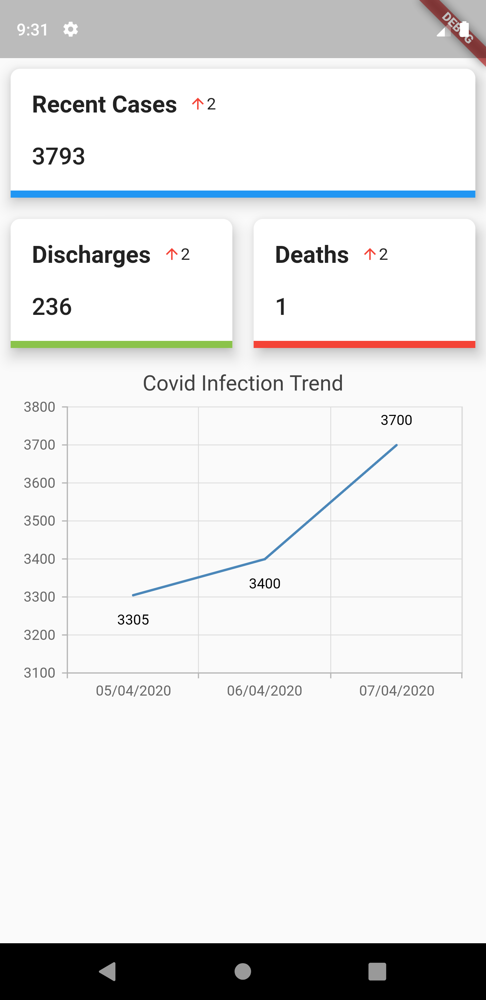

# my_covid

App for Malaysia's COVID-19 Statistics.

## Getting Started

Charts using syncfusion_flutter_charts Flutter Package

- [Flutter Package](https://pub.dev/packages/syncfusion_flutter_charts#-readme-tab-)

## BEFORE USING THE PACKAGE

This is a commercial package. Register at [Syncfusion](https://www.syncfusion.com/flutter-widgets/flutter-charts) to get a registered license key.

